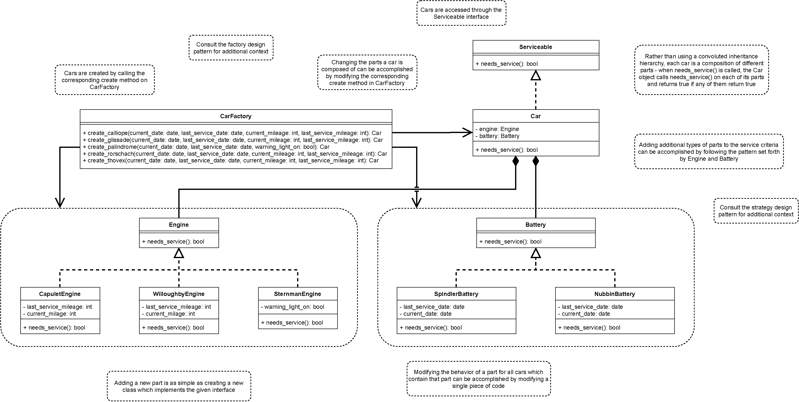

# Forage-Lyft-Starter-Repo

This repo has forked off from forage-lyft-starter-repo for a project.

Code architecture in this repo has been restructured to better accommodate future changes in service criteria and car models.

This code has also been refactored with Factory Design and Strategy Pattern.

## UML

